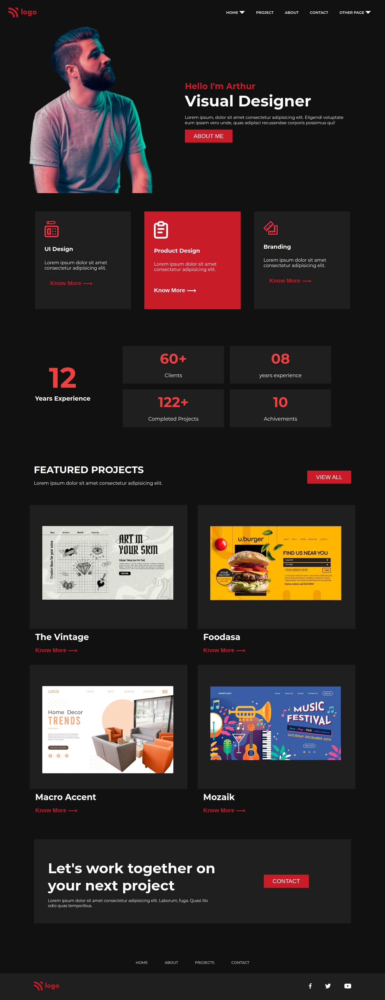
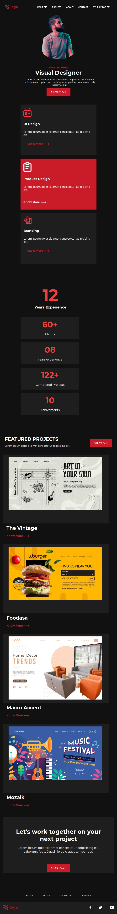
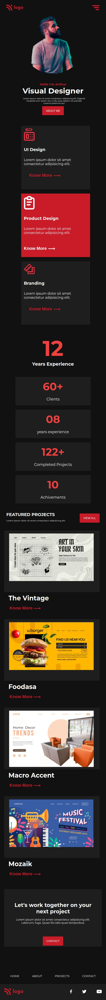

# Assignment 15
15th August 2022
## Full Stack Javascript Web Development Course by [iNeuron](https://ineuron.ai/)

This webpage is created with core HTML and CSS. This webpage is fully responsive and it is also the first responsive webpage I have built. I have used media query for responsiveness and did not use any framework. It took me almost 8 to 10 hours to complete this project.This project helped me to learn responsiveness of webpage and using media query to achive full responsiveness.Images and icons are collected from [icons8](https://icons8.com/) and [iNeuron](https://ineuron.ai/).

[Click Here](https://fsjs-assignment15.netlify.app/) to view the website.

## View of full webpage in normal laptop screen:

## View of full webpage at 724px width:

## View of full webpage at 500px width:

## Contact me: [Linkedin](https://www.linkedin.com/in/subham-dutta-8670b8178/) | [Github](https://github.com/Sduttt) | [Twitter](https://twitter.com/Subhamd88404337) | [Facebook](https://www.facebook.com/profile.php?id=100073951804006) | [Instagram](https://www.instagram.com/its_subham_dutta/)

## Find me on [Findcoder.io](https://www.findcoder.io/u/sdutta)